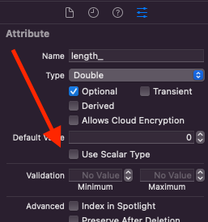

+++
title = "CoreData Swift Scalar Optionals"
date = 2022-01-22T00:00:00Z
tags = ["coredata", "swift"]
+++


The project I am currently working on has an input form that takes doubles for some of its fields. I am using CoreData to persist my data and was surprised to find optional scalars are not supported.

Regardless of whether or not Optional is checked, the type in the Swift codegen will always be Double and never be optional. This behaviour is not a bug, but rather just a difference in how Optionals work in CoreData - it refers to _optional at save time_.

This lack of optional data type creates a problem when trying to have a field for a Double type in an input form like I was attempting to do. No matter what, there is a value present - 0.0. I want the option for the TextField to be blank, and reserving the 0 value for a nil equivalent is not an option in all cases.

I played around with NSValueTransformer for quite a bit, which at first appeared like the perfect tool for the job. Alas, I couldn't get it working as I hoped. If I remember correctly, the dead-end was when realizing the transforming type needs to inherit from NSObject, which Double does not.

## The Solution

I finally landed on something that feels clean and doesn't have much boilerplate, so I thought I would share.

The first step is to disable "Use Scalar Type" on your attribute in the Data Inspector.



Doing this will change the data type in the Swift codegen from Double to NSNumber?, which you can see is optional (yay!)

Now that we have an NSNumber? as our type, we want to extend our NSManagedObject codegen with a get/set as a Double?.

```
extension MyEntity {
    var length: Double? {
        get {
            if let value = length_?.doubleValue, value > 0 {
                return length_
            } else {
                return nil
            }
        }
        set {
            if let newValue = newValue {
                length_ = NSNumber(value: newValue)
            } else {
                length_ = nil
            }
        }
}
```

To call it out and make it obvious, please note that the attribute's name in CoreData is length\_, with an underscore at the end, and the calculated property we are creating in our Swift extension is length, without an underscore.

This code should be pretty straightforward stuff. However, it isn't terrific to rewrite this every time you want a Double? type. Instead, you can change this to the following to make it reusable with little repetitive code.

```
extension NSManagedObject {
    func optionalGet(storedValue: NSNumber?) -> Double? {
        if let value = storedValue?.doubleValue, value > 0 {
            return value
        } else {
            return nil
        }
    }
    
    func optionalSet(newValue: Double?, destination: inout NSNumber?) {
        if let newValue = newValue {
            destination = NSNumber(value: newValue)
        } else {
            destination = nil
        }
    }
}

extension MyEntity {
    var length: Double? {
        get { optionalGet(storedValue: length_) }
        set { optionalSet(newvalue: newValue, destination: &length_) }
}
```

This code now extends NSManagedObject instead, adding general functions for getting and setting Double?. The extension for our CoreData entity calls those, passing our stored value to the setter as a reference.

I also needed Decimal? as a stored type. Here is another extension, overloading the optionalGet and optionalSet to work with Decimal?.

```
func optionalGet(storedValue: NSDecimalNumber?) -> Decimal? {
    if let value = storedValue?.decimalValue, value > 0 {
        return value
    } else {
        return nil
    }
}

func optionalSet(newValue: Decimal?, destination: inout NSDecimalNumber?) {
    if let newValue = newValue {
        destination = NSDecimalNumber(decimal: newValue)
    } else {
        destination = nil
    }
}
```
