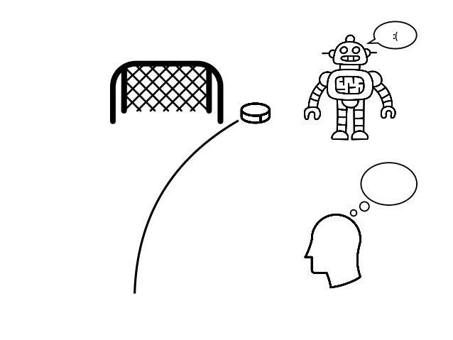
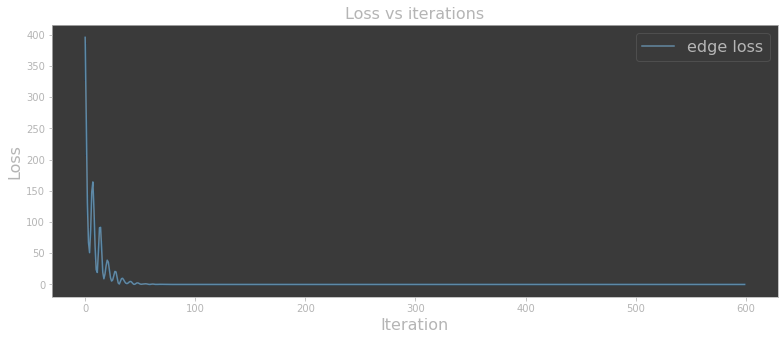
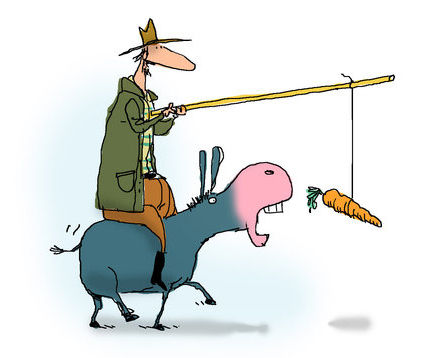

+++
title = "Loss vs. reward in reinforcement learning"
date = 2021-10-17T00:00:00Z
tags = ["deep-learning", "pytorch", "reinforcement-learning"]
+++

Reinforcement learning is my area of focus so far when it comes to deep learning. RL is probably is not the first stop for most on the machine learning education circuit, but it just happens to be where the problem I am trying to solve has taken me.

When starting down the RL road, I was immediately confused by the concept of reward. Nothing was confusing about what it was - giving a dog a treat when it sits after you've asked it to sums things up pretty well. Instead, I was confused by its relation to the loss function. Both, at a high level, help inform when the correct thing is happening.

## RL primer

Skip this if you're already familiar with RL.

If you're unfamiliar with reinforcement learning - things work a bit different from standard deep learning. There are similar concepts, but the terminology and applications have shifted somewhat. The purpose is to train an agent (think robot) to navigate an environment (play a game, or more generally, accomplish a task).

Neural networks are still present in RL, but they are applied differently, and, in my experience so far, the emphasis is less on the NN and more on the environment. For example, there is a high-level wrapper library for RL, [stable-baselines](https://github.com/DLR-RM/stable-baselines3), which can handle all of the NN setups for you.

There is no dataset in machine learning. Instead, you have an environment. To properly train your agent, you need to create a custom environment for your agent to interact. A standard template exists for creating custom environments. You need to describe the environment state, the agent's allowed actions, and the reward for said actions.

Whereas the goal of other types of ML is to minimize loss, the agent in RL is determined to maximize its reward. It will seek out ways to get the highest score possible.

That's all for now!

## Swinging blind and striking out

I jumped straight in, deciding not to get caught up too early by the nuances of reward vs. loss and see how far I could get with reward only. The answer? Not very!

My experiments focused mainly on rewarding the agent when closer to the desired goal than in the previous state. I played around with many different additional ideas surrounding this core concept.

I realized a potential flaw in my strategies in that my reward scheme was not predictable enough. I couldn't tell what the accumulated score meant. This idea came from the concept that the agent will seek to maximize its score. Therefore, it should be somewhat absolute and predictable.

In my next rounds of refining my rewards, I made an effort to incorporate this idea. I also borrowed some ideas from other environments I found in the [OpenAI Gym](https://gym.openai.com/envs/#classic_control). Still no significant improvements.

## Revisiting the original question

With lots of experience in what isn't working, I returned to my original query of the difference between loss and reward. Research revealed some interesting insights.

It turns out, what I was doing was something called reward shaping. It is not an evil concept or a bad thing but seems to get overused and easily abused. The description I read that helped most with bringing perspective was that in shaping the reward, you are slowly removing machine learning from the equation. Instead of the machine _learning_ what to do, you are _telling_ it what to do.

While this idea may be too "ML purist," it helped give a basis for understanding where rewards might have a limit and where loss might come back into the picture.

## Hindsight experience replay

This new information sent me down a new path of discovery. In reading more about reward shaping, I discovered hindsight experience replay (HER). It turns out, over-engineering reward schemas is a prevalent problem in RL, and HER is a more recent solution to help overcome the problem.

Environments can quickly become very complex, making the agent receive a reward in **extremely** rare circumstances. When this happens, the agent doesn't get rewarded, which means it doesn't learn. The natural next step is to begin adding interim rewards, hoping to increase the reward frequency, so the agent learns.

HER emulates a more human-like learning experience, where the agent will learn from its failures. I've read a great example: imagine you shoot a puck at a hockey net, and it goes wide to the right. Typical RL will assess the situation, see that you didn't get the puck in the net, and not reward you. That is all you would know as the agent - "I didn't get rewarded."

As humans, we assess more from this scenario and understand more than just "I didn't get rewarded." We realize that we shot the puck wide and to the right, and so, therefore, next time, if I want to hit my goal, I should shoot more to the left.

HER brings this same notion to RL, helping the agent learn not only from its successes but also from its failures. Using HER means reward shaping can then be reduced, and positive rewards can remain sparse.

I tried implementing HER and did see some success, which was quite exciting. Still, my success was only peaking at around 50-60% in an environment I could not have simplified further.

## Back to custom loss

Although I saw some signs of life from HER, the success rate in the most simplified environment possible was not enough. With plans to return to HER again later, it was time to return to a custom loss function.

To give some insight into my problem space, while keeping it minimal - I am working on solving point coordinates of a mesh. The predicted numbers have a special relationship, representing a mesh, and not considering this relationship will make those predictions less accurate.

I installed [PyTorch3D](http://pytorch3d.org) to leverage the mesh framework within, even though my problem is in 2D space, and it was quick and easy to create a custom loss function. I made the environment slightly more complicated once again and tried running my optimization loop. Keep in mind - this is not RL at this point, but instead just testing a theory on convergence for my problem, similar to [PyTorch3D's Fit Mesh](https://pytorch3d.org/tutorials/deform_source_mesh_to_target_mesh) tutorial. The result was great!

## What have I learned?

We are now up to speed with where I am currently in my adventures. Through this process, I feel my understanding of loss vs. reward has improved, where I can at least now come up with a plan on how to employ both tools to work together on the same problem at the same time.

Here is how I am summing things up for myself regarding loss and reward:

- Loss is like the game of hot and cold. It measures relativity, and it helps in the journey of getting to the goal.
- Reward is received for being in the desired state (or not). It is more absolute, and should be given sparingly.

You can roughly fit both into the carrot and stick analogy if you squint your brain a bit.

My next steps are to provide even more complex examples to the current setup to stress test further, then return to RL to create an agent and environment to deploy this solution, hopefully.

My learnings are still a WIP, obviously, so there is a possibility I'm still off. I'll aim to update again later with however things progress.
