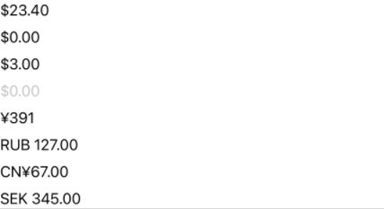

+++
title = "My SwiftUI Currency Field"
date = 2022-01-12T00:00:00Z
tags = ["ios", "swift", "swiftui"]
+++


I've been spending a lot of time in SwiftUI lately and, so far, I love it.

While it is remarkably flexible and powerful, it is still very young. There are still pain points from what seems to be a lack of coverage in the framework. Worse still, because it is changing and updating so rapidly, I am finding that much advice on StackOverflow and many blog posts are outdated already.

One such area is with entering currency values in an application. Searching this topic brought back many results, but all of which seemed overly complicated. I returned to this today and came up with what I feel is a solid and straightforward solution, so I thought I would share!

```
import SwiftUI

struct SelectOnFocus: ViewModifier {
    func body(content: Content) -> some View {
        content
            .onReceive(NotificationCenter.default.publisher(for: UITextField.textDidBeginEditingNotification)) { obj in
                if let textField = obj.object as? UITextField {
                    textField.selectedTextRange = textField.textRange(from: textField.beginningOfDocument, to: textField.endOfDocument)
                }
            }
    }
}

extension TextField {
    func selectOnFocus() -> some View {
        modifier(SelectOnFocus())
    }
}

public struct CurrencyField: View {
    
    @Binding var value: Decimal?
    @FocusState private var isActive
    
    var locale = Locale.current
    
    var formatter: NumberFormatter {
        let formatter = NumberFormatter()
        formatter.locale = locale
        formatter.numberStyle = .currency
        return formatter
    }
    
    public var body: some View {
        TextField(formatter.string(from: 0) ?? "0",
                  value: $value,
                  format: .currency(code: locale.currencyCode!))
            .selectOnFocus()
            .multilineTextAlignment(.trailing)
            .focused($isActive)
            .keyboardType(formatter.maximumFractionDigits > 0 ? .decimalPad: .numberPad)
            .allowsHitTesting(false)
            .overlay(
                GeometryReader { geometry in
                    Button { isActive = true } label: { Color.clear }
                        .frame(width: geometry.size.width, height: geometry.size.height)
                }
            )
    }
}

struct CurrencyField_Previews: PreviewProvider {
    static var previews: some View {
        VStack {
            Group {
                CurrencyField(value: .constant(23.40))
                CurrencyField(value: .constant(0.0))
                CurrencyField(value: .constant(3.0))
                CurrencyField(value: .constant(nil))
                CurrencyField(value: .constant(391), locale: Locale(identifier: "ja_jp"))
                CurrencyField(value: .constant(127), locale: Locale(identifier: "ru_ru"))
                CurrencyField(value: .constant(67), locale: Locale(identifier: "zh-cn"))
                CurrencyField(value: .constant(345), locale: Locale(identifier: "sv-se"))
            }
        }
        .previewLayout(.sizeThatFits)
    }
}
```

And here are the results from the PreviewProvider.



The behaviour is similar to a currency field you often see in apps.

- The text field is overlayed with an invisible button, blocking direct interactivity to the field. Pressing the button activates the text field for editing.
- Upon activation, the text field's contents are selected, making it so the user will fully re-enter the price each time.
- Keyboard is either decimal pad or number pad, depending on the locale being used. If the local doesn't support decimal places with their currency (i.e. Japan), then there is no reason to present the decimal pad keyboard.
