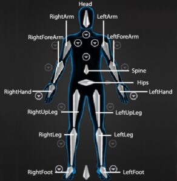

+++
title = "Regular Expressions"
date = 2022-09-08T00:00:00Z
draft = true
+++

Learning regex is one of the most valuable time investments I've made in my career. It is (mostly) the same across programming languages, and is integrated into most text editors and IDEs. It is always there to help get me out of a jam or complete an otherwise laborious task super quickly.

Early in my career, one of my seniors tried to steer me away from regular expressions. "It's convoluted and is hard for others to read," and "it can all be done just with code," he said. The amount of code needed to replace a single, relatively simple regex can be astronomical. And, instead of shying away from something because others might have a hard time, I'd prefer to enlighten others so they can also take advantage of the awesomeness that is regular expression.

And that is why we are here 😁

## What is regex?

Regex, or regular expressions, is a pattern recognition sub-language within Python (and other languages). You use it to analyze strings to check if they adhere to the pattern. Even better, you can use regex to extract data from strings.

You might think, "big whoop. I can do that with string splicing!" Fair enough. It might be hard to comprehend how cool this is without seeing an example.

## A Simple Example

If you're visiting my blog, you're possibly a technical artist or rigger. One of the most standard things to do for your production is to establish naming conventions. Nodes, files, whatever. We should name them predictably.

To keep things simple for now, let's use an already established naming convention: Motionbuilder's Required HIK Nodes.



```
^(Left|Right)?([A-Za-z]+)$
```

With this pattern, we can pass any string to it and a) confirm if it is a valid name, and b) get back the side and the rest of the name. Let's put it to the test, shall we?

```python
import re
for name in ['Head', 'RightArm', 'LeftArm', 'Spine', 'LeftUpLeg', 'RightHand', 'MiddleHips', 'LArm', 'LeftMadeUpJoint', 'AnotherMadeUpJoint']:
    match = re.match(r'^(Left|Right)?([A-Za-z]+)$', name)
    if match:
        print(match.groupdict())
    else:
        print(f"No match for {name}")
```
