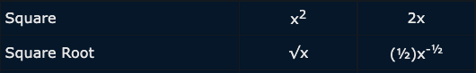

+++
title = "SymPy to Solve a Low Level ML Training Loop"
date = 2022-08-26T00:00:00Z
tags = ["machine-learning", "python", "swift"]
[cover]
  image = "images/sympy-1.png"
+++

A few months ago, I overcame a challenging hurdle in my spare time passion project. It seemed like I reached a dead end, but I got past it thanks to discovering a new Python package, SymPy.

## The Background

After going down the rabbit hole with reinforcement learning, I conceded my problem was best solved using a regression algorithm. Still, the best results I saw came from exploiting the training loop in the early days.

I was hoping to have a trained model for an easier deployment to iOS, but alas. With the change in direction, I couldn't take advantage of popular ML packages. While we can deploy their trained models, they do not offer on-device training. Also, Apple’s ML offerings didn’t pinpoint what I needed. I had to make things work at a lower level.

## First Attempt

My research so far gave me a clearer understanding under the hood of a training loop. I already figured out my forward propagation, but the big missing piece of the puzzle was in the back propagation: finding the derivative.

The automatic derivative calculation is one of the biggest boons for using an ML framework. There is a _lot_ of heavy lifting happening here with complex calculations. I consider myself to be a smart guy, and while I feel I am good at math, I am not some math wizard. My strength is problem solving and critical thinking. This math was looking too advanced.

I started searching for new ways to continue moving ahead and found an article talking about how Swift was an auto-differentiable language. I didn’t realize that! Maybe it will solve all my problems! I wish.

To take advantage of the auto-diff feature, I had to install a preview toolchain of Swift. For lack of other ideas, I did. I set up my forward prop function to return the derivative, and it regressed to the solution I wanted to see for every problem I threw at it. I was thrilled!

Before moving on to the next set of tasks, I wanted to do my due diligence. When would the proposed auto-differential addition to Swift be released? After all, I wouldn’t be able to ship an app using an unreleased toolchain. It turns out there was no ETA. I couldn’t depend on this solution at all.

Onward and upward! The exercise was still valuable because I confirmed this was possible. I just needed to figure out the derivative formula.

## Enter SymPy

I started researching derivative calculations again and learned quickly it was not something I’d be figuring out on my own.

My efforts rerouted to revisiting the ML frameworks to see if they could expose the derivative formula they use for a network. No such luck.

Soon I discovered [SymPy](https://www.sympy.org/en/index.html), with “Sym” standing for Symbolic Mathematics. The library allows you to define a mathematic formula using variables without having to populate said variables. You can then run calculations on the formula, such as simplifying it or… [calculating the derivative](https://docs.sympy.org/latest/tutorials/intro-tutorial/calculus.html)!

Bingo. SymPy was my golden ticket.

Now, I still had some obstacles in my way. I was using a for-loop in my algorithm, as well as absolute value. How would I go about these?

The for-loop was just a summation. The Sum Rule shows to get the derivative of f + g, you add the derivative of f and the derivative of g.

<figure>

<figcaption>

[Derivative Rules - Math Is Fun](https://www.mathsisfun.com/calculus/derivatives-rules.html)

</figcaption>

</figure>

So, as long as I can calculate the derivative of the contents of my for-loop, I can just sum them after. See, “you can ignore the for-loop”.

As for the absolute value - it was trickier to figure out. Absolute value is weird for derivatives. It turns out, you can’t calculate it because it is not a continuous curve. The absolute value of 0 is 0 and therefore there is a single point where there is no tangent.

The trick for circumventing this problem is to take advantage of getting the square root of a squared value. Both functions have calculable derivatives, and of course, it is equivalent to getting the absolute value.

<figure>

<figcaption>

[Derivative Rules - Math Is Fun](https://www.mathsisfun.com/calculus/derivatives-rules.html)

</figcaption>

</figure>

I started down this road, but it turns out there is an even easier way. SymPy has a keyword argument when defining your symbols to show your symbols will all be real numbers: real. Toggling this to true fixed all my problems with absolute value.

## In Closing

After this, I had my derivative formula. Plugging it into my Swift code, I had my complex regression working on-device. SymPy was a godsend and I wouldn’t have solved these problems without it.

The only oddity I experienced was after getting it to solve the derivative. The equation was still long, and calling the simplify method made it even longer. I simplified it down to something concise and readable, so I don’t know why it struggled.

The documentation is top-notch and has interactive code snippet examples throughout that you can run in-browser. Don't be afraid to have a look because they make it easy for you.

SymPy is fantastic and should always be in your back pocket as a secret weapon if you’re ever in a mathematical bind.
