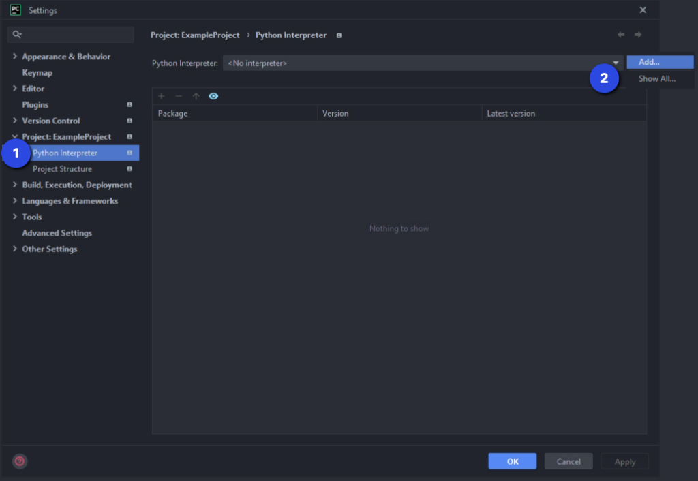
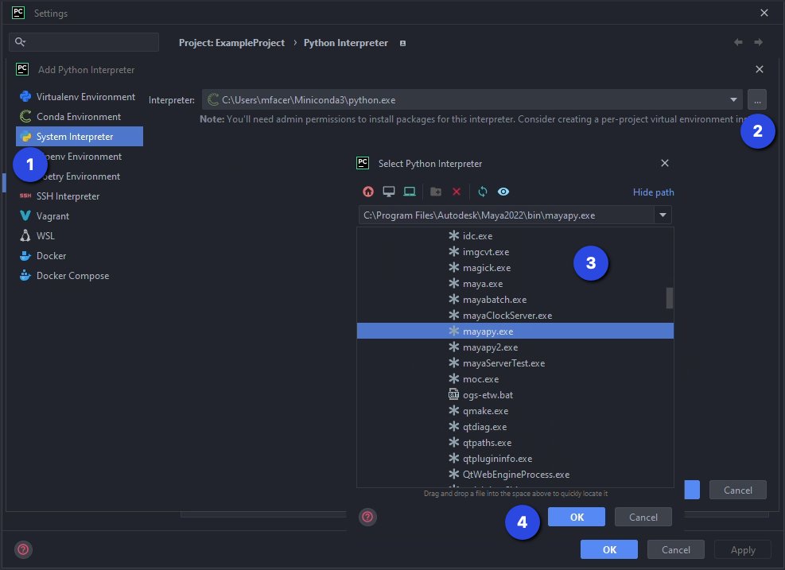
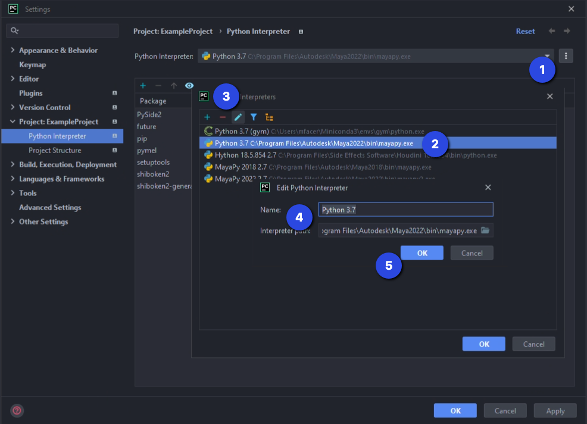
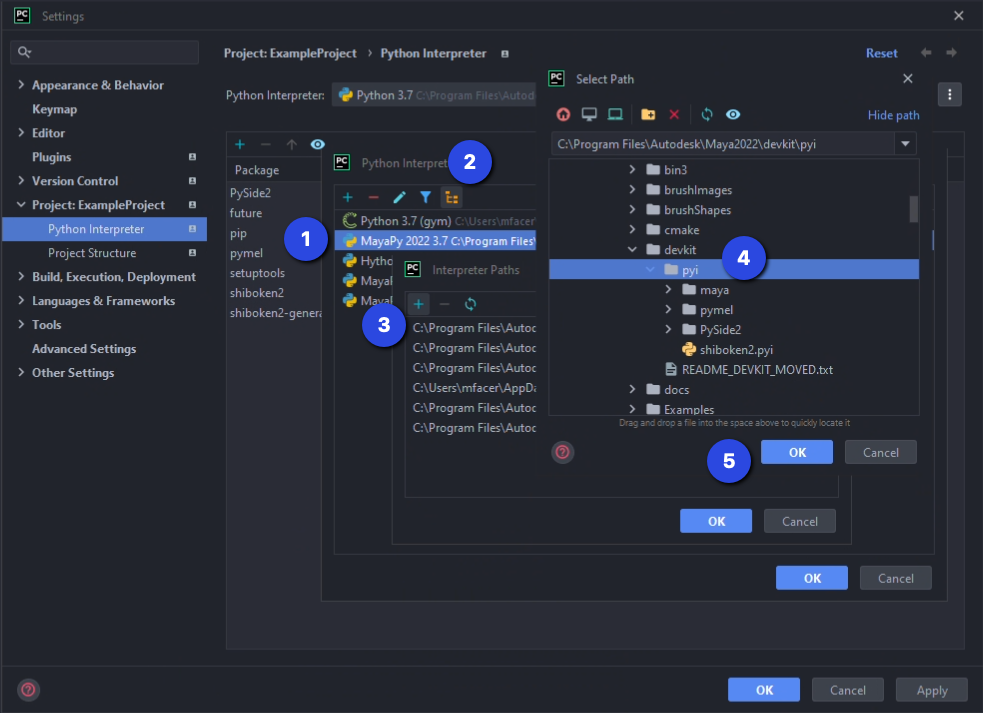

+++
title = "The Best PyCharm MayaPy Interpreter Setup"
date = 2022-06-16T00:00:00Z
tags = ["autocomplete", "maya", "pycharm", "python", "setup", "tech-art"]
[cover]
  image = "images/68RuLLrsBdxbVJLxm3py3YoK6zX0aPIv3qttEhkb0_4.webp"
+++


There's no denying - Maya makes development hard.

Python is one of the most popular programming languages in the world as of 2022. The language supports many great workflows, but most are off-limits when working with Maya. Even just setting up an IDE with MayaPy has been a challenge through the years.

Today I will share how I set up PyCharm to work with MayaPy and how it enables a super-slick workflow for unit testing.

## Getting Maya Python stub files

To get started, we'll fetch Maya's devkit. If you're unfamiliar, the devkit contains autocomplete stubs for Maya's Python modules. Download the appropriate one for your version of Maya from [here](https://www.autodesk.com/developer-network/platform-technologies/maya and download the).

With it downloaded, you'll find the stub files at the following location inside: `devkit/other/Python(x)/pymel/completion`

There is a special kind of stub file PyCharm supports that we will take advantage of - pyi files! I reached out to Autodesk several years ago when I first learned of pyi files and asked them to begin including them with Maya distributions. So, if you see a folder named "pyi" in the devkit location from above, use it. If you are on a version of Maya where the devkit _doesn't_ include pyi files, we can make them ourselves! All you need to do is rename the extension of the .py Maya stubs to .pyi. Here is a short script to help you with the renaming.

```
import os
import shutil
def rename_from_py_to_pyi(py_dir, output_dir):
    shutil.copytree(py_dir, output_dir)
    for root, _, files in os.walk(output_dir):
        py_files = [os.path.join(root, f) for f in files if f.endswith('.py')]
        for f in py_files:
            os.rename(f, '{}i'.format(f))
if __name__ == '__main__':
    # Update below with the appropriate local paths for your machine
    rename_from_py_to_pyi(r'/Users/mat/py', r'/Users/mat/pyi')
```

Find a nice home for these pyi stubs on your hard drive, as we will be using them when we set up our MayaPy interpreter. The most obvious place to put them is in the, otherwise empty, devkit folder in your Maya installation location.

## Setting up the MayaPy interpreter

Now that you have a stubs folder full of .pyi files, it is time we set up our MayaPy interpreter in PyCharm. If you've done this before using past approaches, this time will be slightly different because of pyi, so be sure to follow along.



1. In PyCharm's Settings, go into _"Project: <Your Project Name>"_ and choose _"Python Interpreter"_ from the left-side menu.
2. Click on the _"..."_ button to the right of the _"Python Interpreter:"_ dropdown and choose _"Add..."_



1. Select _"System Interpreter"_.
2. Press the _"..."_ button to the right of the _"Interpreter:"_ dropdown. It will pop up a new window.
3. Navigate to your Maya installation's bin folder and choose _"mayapy.exe"_ (or _"mayapy2.exe"_).
4. Press OK



1. Press the _"..."_ button to the right of the _"Python Interpreter:"_ dropdown again. This time choose _"Show All..."_
2. From the list of interpreters that appears, choose the one you just made.
3. Press the pencil, _"Edit"_, button to give it a better name.
4. Rename it to something more descriptive. I like to follow the template of _"ExeName AppVersion PythonVersion"_, i.e. _"MayaPy 2022 3.7"_
5. Press OK to accept your changes.



1. Select your newly renamed Python Interpreter again from the previous window.
2. This time, press the tree, _"Show paths for the selected interpreter"_, button.
3. Press the _"+"_ button to add a new path.
4. Navigate to the _"pyi"_ stubs folder that we made previously, wherever you decided to keep it.
5. Press _"OK"_ on all windows until your settings updates have been accepted.

You're all done! Congrats!

There were a lot of steps here, but this is extremely straightforward after you've done it once.

## Why is this awesome?

### Direct Set-Up

This first reason is admittedly minor, but it is more direct than popular recommendations in the past. Previously it was suggested to do all of the steps above, but then also remove Maya's site-packages folder from the interpreter paths to set up auto-complete properly. This removal step was always unintuitive but necessary so as to avoid conflicts between the stub files and the same modules found in Maya's site-packages folder.

Why don't we need to solve the conflict problem here? More on that in a bit.

### All-encompassing Auto-complete

Because we do not remove Maya's site-packages folder, if there are other packages or modules installed there you will get auto-complete for them also since they are all still on the pythonpath.

## The Power of pyi

Coming back to the question, _“why don’t we need to solve the conflict problem here?”_ The answer to that question comes from those pyi stubs we made.

The pyi files unlock special functionality with PyCharm. PyCharm knows to use these files in the editor for auto-complete purposes but then ignore them when running code and use the real modules instead. This is game-changing for MayaPy developers, and this is what makes this setup so great.

Why, you ask? Well, this magic brings our environment more in line with a regular Python development environment. You still can’t create virtual environments (at least I haven’t got that working yet), but we do unlock several other great workflows - and with minimal effort!

### Unit testing

You can now take advantage of unit testing directly inside PyCharm! This works using the default built-in unittest module and with PyCharm’s test running interface.

The only thing you need to do to get this working? Initialize Maya! In your tests folder, create an \_\_init\_\_.py file and put your code there for initializing Maya’s standalone mode. Run your tests, and that \_\_init\_\_.py file will be run, and the rest just works.

### Coverage

If you don’t already know, pip works with Maya and has for years. You can pip install the coverage package and run your unit tests with coverage now, too! PyCharm will give you line-by-line highlighting to show you what is covered and what is not.

### \_\_name\_\_ == “\_\_main\_\_”

Similarly, slap that same `maya.standalone.initialize()` code in a `__name__ == “__main__”` block at the bottom of a file, followed by some test code for testing your module, and be able to run it. Super fast iteration without even having to launch Maya!

### PySide iteration

Speaking of which, if you’re clever about structuring your PySide GUI classes, you can do most (if not all) of your GUI work by launching it from PyCharm now!

Create the main class to contain the bulk of your GUI, but omit code that handles integrating it with Maya’s GUI. Save that to be implemented in a Maya-specific subclass. Call the main class from within PyCharm, within your `__name__ == “__main__”` block, and then call the Maya-specific class inside Maya. Say goodbye to all that unproductive time waiting for Maya to start up and shut down!

## In closing

I’ve been using this PyCharm setup for several years, and I’ve been thrilled with it. It feels like a massive step toward normal Python development for Maya. Unit testing and improved iteration truly transform the experience. I hope others will be excited to discover how easy it is to unlock these features, and if you discover any other cool workflow improvements I'd love to hear about them!
